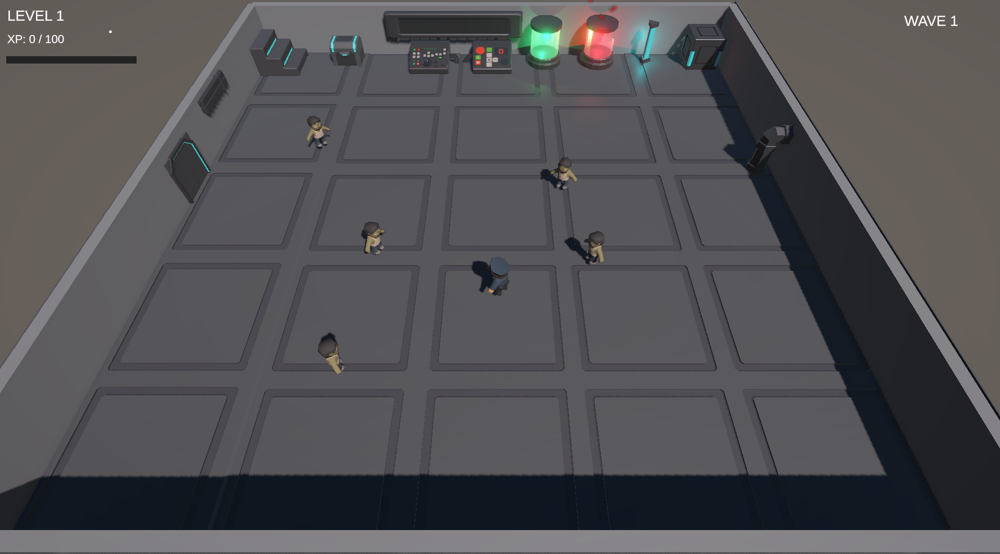
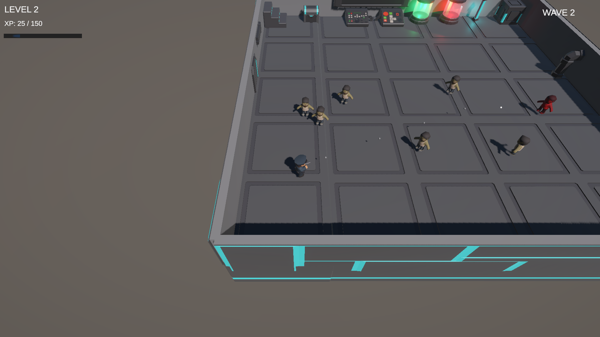
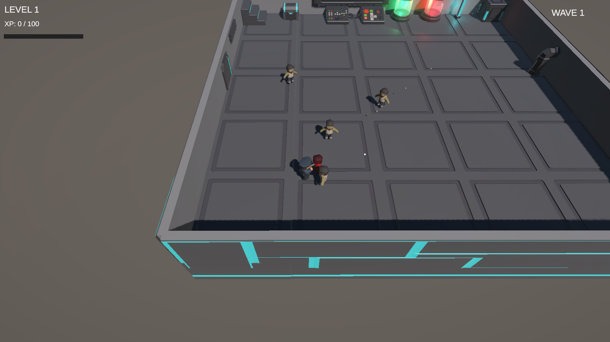
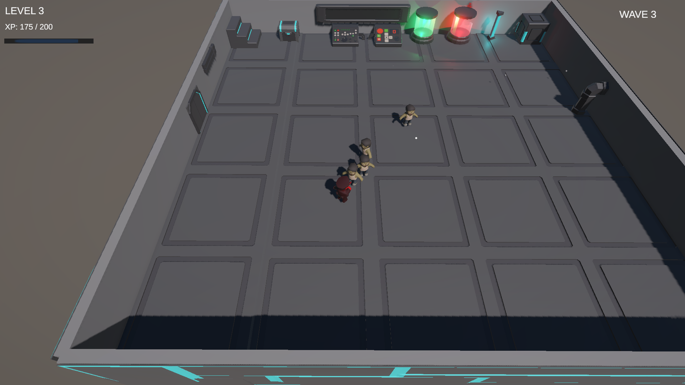
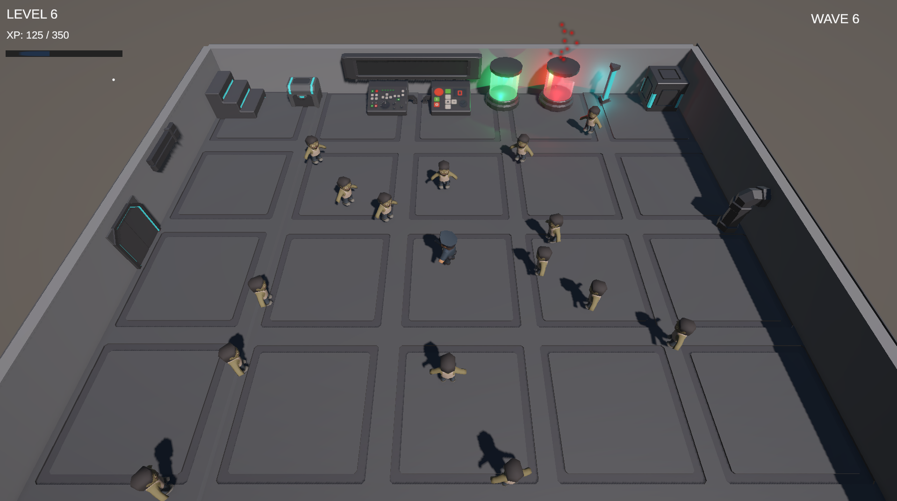
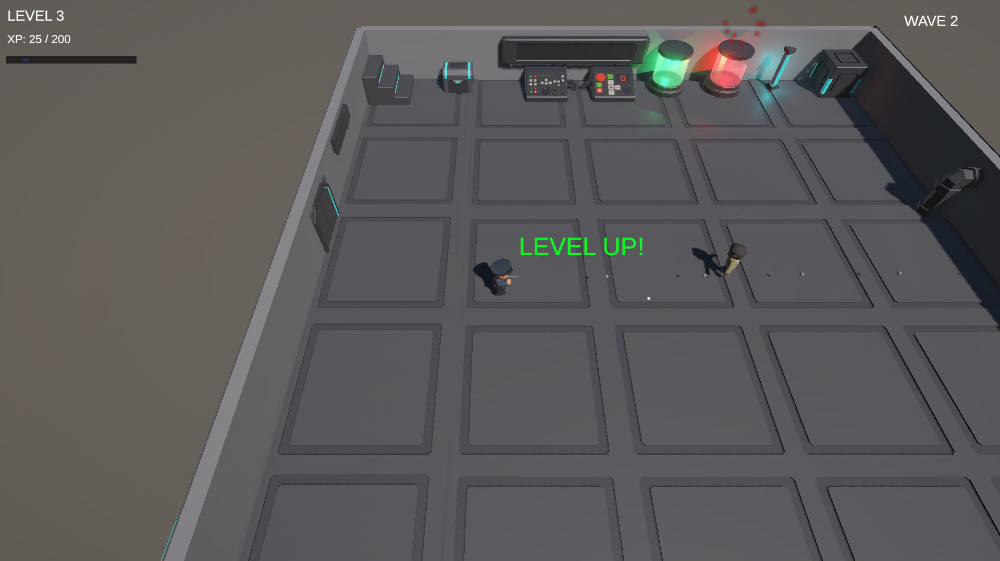
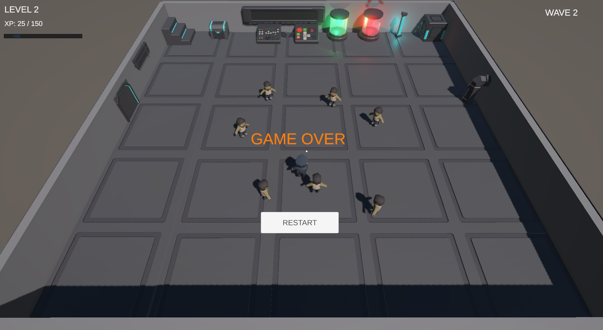

# Survival Protocol

A 3D zombie-survival shooter built in Unity and C#.

## 🎮 Game Concept

**Survival Protocol** is a wave-based survival shooter set inside a
sci-fi laboratory after a chemical experiment goes wrong.

A failed experiment causes a dangerous outbreak, turning people into
zombies. The player takes the role of a police officer trapped inside
the facility and must survive increasingly difficult waves of infected
enemies.

## ✨ Features

-   Police officer player character
-   Zombie enemy characters
-   Shooting and projectile combat
-   Mouse-following crosshair
-   Muzzle flash and shooting audio
-   Player health and damage system
-   Player and enemy hit-flash feedback
-   Enemy death system
-   XP and progression system
-   Level-up upgrades
-   Wave-based enemy spawning
-   Game Over and Restart system
-   Chemical outbreak environment
-   Toxic leak particle effect
-   Emergency chemical lighting
-   Modular sci-fi laboratory environment
-   Environment collisions
-   HUD with Level, XP, XP bar, Wave and Crosshair

## 🛠️ Technologies

-   Unity 6.3 LTS
-   C#
-   Universal Render Pipeline (URP)
-   Unity Input System
-   Unity UI / TextMeshPro
-   Unity Physics
-   Particle System
-   Audio System

## 🧠 Gameplay Systems

### Player

The player can move around the laboratory, aim with the mouse and shoot
enemies.

### Combat

Bullets damage zombies. Enemies flash red when hit and are destroyed
after receiving enough damage.

### Health

The player has a health system. Enemy attacks reduce player health. When
health reaches zero, the player dies and the Game Over screen appears.

### XP & Leveling

Defeating enemies awards XP. When enough XP is earned, the player levels
up and receives gameplay upgrades such as increased damage and movement
speed.

### Enemy Waves

Enemies spawn in waves. Later waves increase the number of enemies,
creating progressively harder encounters.

### Chemical Outbreak

The laboratory contains chemical tanks representing the failed
experiment. The contaminated red tank uses particles and emergency
lighting to reinforce the outbreak theme.

## 🎮 Controls

  Action                    Control
  ------------------------- -------------------
  Move                      WASD
  Aim                       Mouse
  Shoot                     Left Mouse Button
  Restart after Game Over   Restart Button

## 📁 Project Structure

``` text
Assets/
├── Scripts/
│   ├── Combat/
│   ├── Enemies/
│   ├── Player/
│   ├── Systems/
│   └── UI/
├── Prefabs/
├── Scenes/
├── UI/
├── Audio/
├── Art/
├── HaniJahanDesign/
└── ToonyTinyPeople/
```

## 🎨 Assets

The project uses imported Unity Asset Store packages for the
player/enemy characters and sci-fi laboratory environment.

Third-party asset folders are kept separate from the project's own
gameplay scripts and systems.

## 📸 Screenshots

### Main Gameplay


### Combat


### Enemy Hit Feedback


### Player Hit Feedback


### Enemy Waves


### Level Up


### Game Over

## 🚀 Build

The project includes a Windows build profile using `Scenes/Game`.

The game has been tested as a standalone Windows build.

## 📚 What I Learned

-   C# scripting in Unity
-   Object-oriented gameplay architecture
-   Player movement and aiming
-   Projectile combat
-   Enemy AI
-   Health and damage systems
-   XP and progression
-   Level progression
-   Wave spawning
-   Game state handling
-   Unity UI and TextMeshPro
-   Particle effects
-   Audio integration
-   Collision handling
-   URP lighting and post-processing
-   Debugging and iterative game development
-   Building and testing a standalone Windows game

## 🔮 Future Improvements

-   Multiple weapons
-   More zombie types
-   Boss enemy
-   Weapon upgrades
-   Health pickups
-   Ammunition system
-   Doors and escape objective
-   Additional laboratory areas
-   More advanced enemy AI
-   Main menu and settings
-   Save/load progression
-   Additional sound effects and music

## 👤 Project

**Survival Protocol**

A personal Unity gameplay project focused on demonstrating practical C#
and game-development skills.
